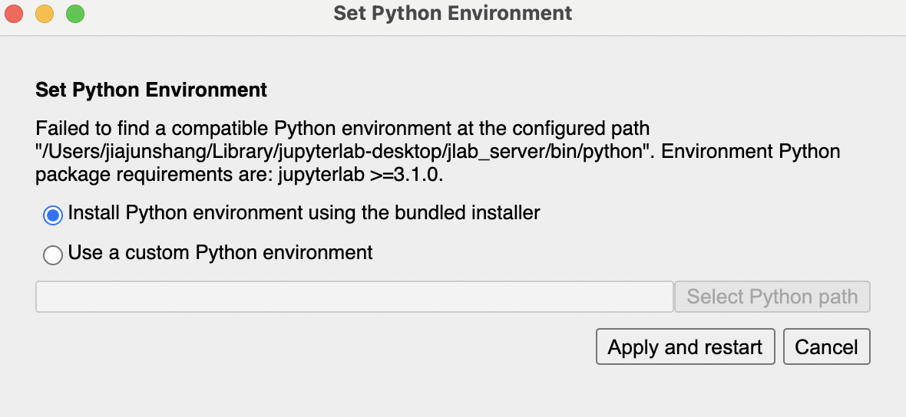
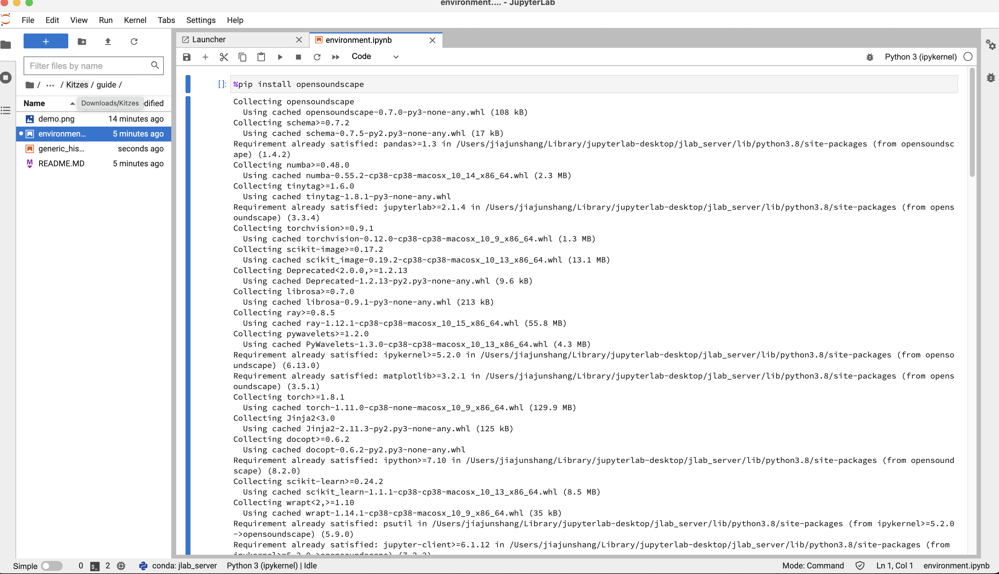
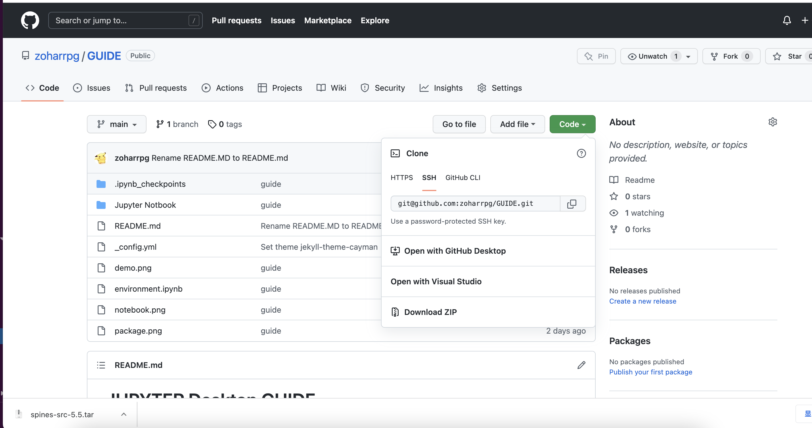
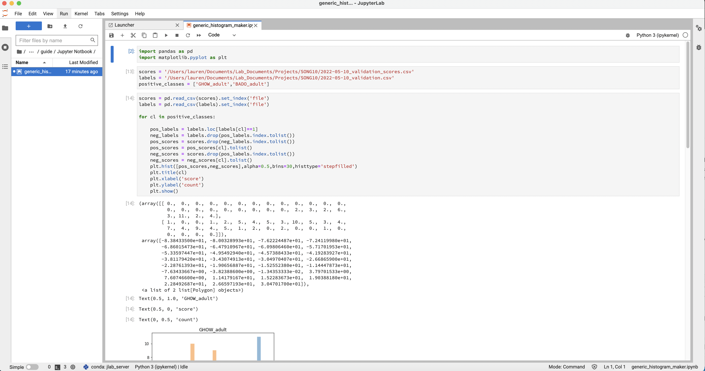

# JUPYTER Desktop GUIDE

## Download
- [macOS Installer](https://github.com/jupyterlab/jupyterlab-desktop/releases/latest/download/JupyterLab-Setup-macOS.dmg)
- [Windows Installer](https://github.com/jupyterlab/jupyterlab-desktop/releases/latest/download/JupyterLab-Setup-Windows.exe)
## Installation and setting up the environment
1. Download the Jupyter Desktop based on your system
2. Click the installer and follow the instructions to install Jupyter Desktop.
3. When you run the program for the  first time, there is a window that ask you to install Python environment. Choose the first option to install Python environment, and click **Apply and restart** button
 
 

4. Open the <strong>environment.ipynb</strong> file in the environment directory using Jupyter Desktop, and run all the code in the file to install packages

 
 
<strong> Congratulation!!! You have finished all the steps for setting up the environment and packages. You only need to do these steps once. Now you can run any Jupyter Notebook we provided.</strong>

## Download code repository
1. Click the green **code** button and click  <strong>Download ZIP</strong>

## Run Jupyter Notebook
1. Open the Jupyter Notebook you want to run by click it on the left side bar

2. Run each code cell by clicking the <strong>Run</strong> button, and you will see the result in the next cell.
